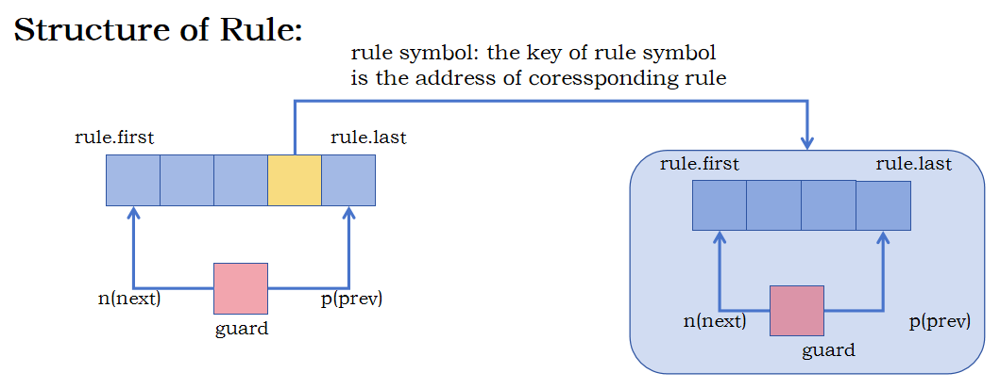
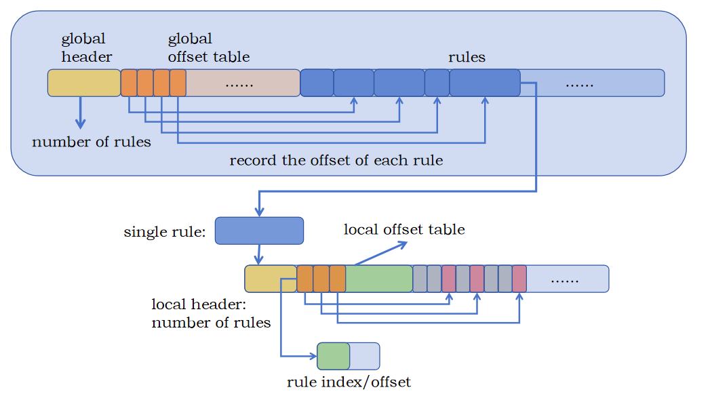

# TADOC Algorithm Implement Document

## `Rule` Data Structure

The data structure of `Rule` can be shown below: 

### `Rule` & `Symbol`

`Symbol` structure stores the pointers `n` and `p`, which are used to point to next symbol and prevent symbol respectively. Besides, another significant varible `key` is also stores in `Symbol`, whose function is described below.

Each element of `Rule` has type `Symbol`. This is implement by a double linked list, hence we don't stores all elements in the `Rule` but store a `guard` varible.

### Guard Symbol 

`guard` is a special `Symbol` type variable in `Rule` structure. `guard` is used to find first element and last element in `Rule`. Because the `n` pointer of guard points to the first element of  `Rule`, and the `p` pointer in of guard points to the last element of  `Rule`. 

### Rule Symbol

Some elements of  `Rule` are non-teminals. These elements are represented by "Rule Symbols". The difference between Rule Symbol and normal symbol are:

- the `key` of  Rule Symbol is the address of corresponding `Rule`, which is an even number.
- the `key` of normal Symbol is `ch * 2 + 1`，where `ch` is the value of origin character. 

For a Rule Symbol, we can find its Rule by key from memory, while for a normal symbol, we can get its origin value by `key / 2`.

Besides, we can judge a symbol's type by its `key`. 

## Compress Data Structure 

The data structure of compress data can be shown below.

### Global Structure 

As we know, TADOC-compressed output are series of rules, so the key point is to store all these rules. Global Structure of compressed ouput can be diveded into three parts:

- Global Header: record the number of rules.
- Global Offset Table: record the offset of each rule in rules array. (from second rule, due to offset of first rule is default 0)
- Rules Array: rules array. 

### Single Rule Structure 

Each rule in the Rules part also has its internal structer:

- Local Structure: record how many symbols in this rule are non-terminal(rule symbol)
- Local Offset Table: indicates which symbol in the symbols array is non-terminal. 
    - the unit of Local Offset Table is a `offset`-`index` couple
    - `offset` records the position of the non-terminal in the symbols array. 
    - `index` records the position of the non-terminal in the global offset table.
- Symbols Array: symbols array